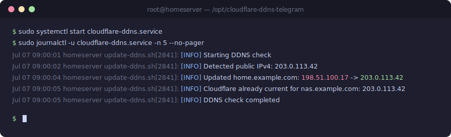
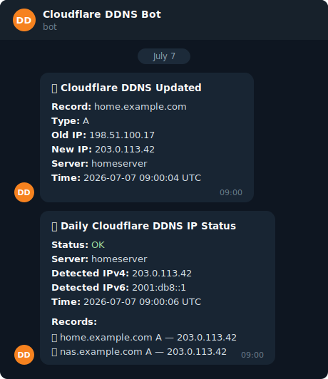

# Cloudflare-DDNS-Telegram

[](https://github.com/atikansari-ghr/Cloudflare-DDNS-Telegram/actions/workflows/shellcheck.yml)
[](LICENSE)

A lightweight Dynamic DNS (DDNS) updater for Cloudflare with Telegram notifications, written in pure Bash. It periodically detects your public IP and keeps your Cloudflare DNS records pointed at it — ideal for home servers, self-hosted services, and any machine on a dynamic ISP connection.

No Python, no Docker, no daemons — just `bash`, `curl`, `jq`, and systemd timers.

## Features

- **IPv4, IPv6, or both** — each record can be `A`, `AAAA`, or `BOTH`.
- **Multiple fallback IP providers** (ipify, icanhazip, AWS checkip, ifconfig.me) with curl timeouts, so a single flaky provider never causes a false failure.
- **Telegram notifications** — on IP change, on errors, optionally on no-change and startup. Every send is delivery-checked against the Telegram API response and retried up to 3 times; failures are logged with the exact error.
- **Crash alerts** — if a service itself fails, a systemd `OnFailure` hook sends a 🚨 Telegram alert with the recent journal lines.
- **DNS verification** — with `VERIFY_DNS="yes"`, updated records are re-resolved via 1.1.1.1 to confirm propagation (DNS-only records).
- **Daily status report** — a scheduled Telegram summary comparing every Cloudflare record against your current public IP (✅ / ⚠️ / ❌).
- **Local state cache** — skips Cloudflare API calls entirely when the IP hasn't changed.
- **Auto-creates missing records** in Cloudflare.
- **Multiple records and zones** via a simple pipe-delimited config file.
- **systemd native** — timers for the update loop and the daily report, plus logrotate.
- **Safe upgrades** — `upgrade.sh` updates the scripts in place while backing up and preserving your configuration.

## Screenshots

A DDNS check run, as seen in the journal:



The Telegram alerts — instant update notification and the daily health report:



*Illustrative output using demo values (`example.com`, documentation IP ranges).*

## Requirements

- Linux with systemd (installer uses `apt`, so Debian/Ubuntu and derivatives)
- `curl`, `jq` (installed automatically by `install.sh`)
- A Cloudflare account and an API token with **Zone → DNS → Edit** permission for the zones you manage
- Optional: a Telegram bot token and chat ID for notifications

## Installation

```bash
git clone https://github.com/atikansari-ghr/Cloudflare-DDNS-Telegram.git
cd Cloudflare-DDNS-Telegram
sudo chmod +x *.sh
sudo ./install.sh
```

The interactive installer will:

1. Install dependencies (`curl`, `jq`, `dnsutils`, `logrotate`).
2. Ask for your Cloudflare API token, zone, and hostname(s).
3. Ask for Telegram settings, check interval, and daily report time.
4. Install everything to `/opt/cloudflare-ddns-telegram`.
5. Install and start the systemd timers.
6. Run a first update immediately.

## Upgrading an existing installation

```bash
cd Cloudflare-DDNS-Telegram
sudo chmod +x *.sh
sudo ./upgrade.sh
```

The upgrade backs up the current installation to
`/opt/cloudflare-ddns-telegram/backup/upgrade-YYYYMMDD-HHMMSS` and preserves:

- `/opt/cloudflare-ddns-telegram/config/config.env`
- `/opt/cloudflare-ddns-telegram/config/records.conf`

New configuration keys introduced by a release are appended with sane defaults.

## Configuration

Two files under `/opt/cloudflare-ddns-telegram/config/` (both `chmod 600`):

### `config.env`

See [config/config.env.example](config/config.env.example).

| Key | Default | Description |
|---|---|---|
| `API_TOKEN` | — | Cloudflare API token (Zone → DNS → Edit) |
| `TELEGRAM_ENABLED` | `yes` | Enable Telegram notifications |
| `BOT_TOKEN` | — | Telegram bot token from [@BotFather](https://t.me/BotFather) |
| `CHAT_ID` | — | Telegram chat ID to notify |
| `SEND_NO_CHANGE` | `no` | Also notify when the IP has not changed |
| `SEND_STARTUP` | `yes` | Send a message on startup/test runs |
| `DAILY_STATUS_ENABLED` | `yes` | Enable the daily status report |
| `DAILY_STATUS_TIME` | `09:00` | Time of day for the daily report (HH:MM) |
| `VERIFY_DNS` | `yes` | After an update, verify the record resolves to the new IP via `dig @1.1.1.1` (skipped for proxied records) |
| `LOGGING` | `yes` | Write logs to `LOG_FILE` |
| `IPV4_PROVIDER` | `https://api.ipify.org` | Preferred IPv4 detection provider (fallbacks are built in) |
| `IPV6_PROVIDER` | `https://api64.ipify.org` | Preferred IPv6 detection provider (fallbacks are built in) |
| `LOG_FILE` / `STATE_FILE` / `RECORDS_FILE` | install paths | File locations |

### `records.conf`

One record per line, pipe-delimited (see [config/records.conf.example](config/records.conf.example)):

```text
# zone_name|record_name|record_type|ttl|proxied
example.com|home.example.com|A|120|false
example.com|nas.example.com|BOTH|120|false
other-zone.net|vpn.other-zone.net|AAAA|300|true
```

- `record_type`: `A` (IPv4), `AAAA` (IPv6), or `BOTH`
- `proxied`: `true` to route through the Cloudflare proxy, `false` for DNS-only

Multiple zones are supported as long as the API token has access to each.

## Usage

The systemd timer runs the update automatically (default: every 5 minutes). Manual operations:

```bash
# Run an update now and watch the result
sudo systemctl start cloudflare-ddns.service
sudo journalctl -u cloudflare-ddns.service -n 50 --no-pager

# Send the daily status report now
sudo systemctl start cloudflare-ddns-status.service

# Timer status
systemctl list-timers 'cloudflare-ddns*'

# Tail the log file
tail -f /opt/cloudflare-ddns-telegram/logs/cloudflare-ddns.log
```

## Project layout

| File | Role |
|---|---|
| `update-ddns.sh` | Main DDNS check/update loop |
| `daily-status.sh` | Daily Telegram status report |
| `cloudflare-api.sh` | Cloudflare API v4 wrapper (curl + jq) |
| `utils.sh` | Public IP detection, validation, state cache |
| `telegram.sh` | Telegram notification helpers |
| `logger.sh` | Timestamped logging |
| `install.sh` / `upgrade.sh` / `uninstall.sh` | Lifecycle scripts |
| `systemd/` | Service units, timers, and logrotate config |

## Getting a Telegram bot token and chat ID

1. Message [@BotFather](https://t.me/BotFather), send `/newbot`, and follow the prompts to get the **bot token**.
2. Send any message to your new bot.
3. Open `https://api.telegram.org/bot<TOKEN>/getUpdates` and read the **chat ID** from `"chat":{"id":...}`.

## Troubleshooting

- **"Zone not found or token lacks access"** — the API token is missing DNS Edit permission for that zone, or the zone name in `records.conf` doesn't match Cloudflare exactly.
- **"Unable to detect valid IPv4"** — all providers timed out; check outbound connectivity. The service already waits 30 s after boot (`ExecStartPre`) to let the network come up.
- **No Telegram messages** — check the journal first: failed sends are logged as `Telegram send failed` with Telegram's exact error (`HTTP 404` = malformed/empty bot token, `HTTP 400: chat not found` = wrong chat ID, `HTTP 401` = revoked token). Then test manually: `curl -s "https://api.telegram.org/bot<TOKEN>/sendMessage" -d "chat_id=<CHAT_ID>" -d "text=test"` and read the JSON response. Remember to `/start` the bot from your account once.
- **CGNAT** — this tool publishes whatever public IP your ISP gives you. If you're behind CGNAT, that IP is shared and inbound connections won't reach you; DDNS cannot bypass CGNAT.

## Uninstall

```bash
sudo ./uninstall.sh
```

Removes the systemd units and optionally the installation directory.

## Security notes

- `config.env` contains your Cloudflare and Telegram tokens; the installer sets it to `chmod 600` and it is excluded from git via `.gitignore`.
- Prefer a scoped API token (DNS Edit on specific zones) over a global API key.

## License

[MIT](LICENSE)
